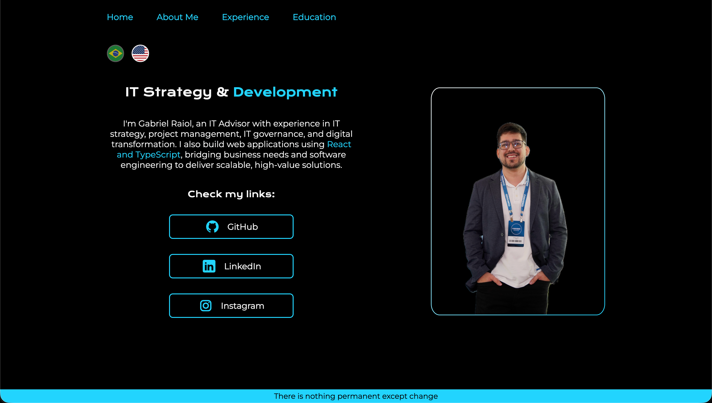

<h1>Gabriel Raiol | Portfolio</h1>
 

 
<a href="https://raiol.vercel.app/" target="_blank">Link to portfolio</a>
 
 

This was my first responsive project, and I use it as my personal portfolio. Whenever there is a need to change some information or add something cool, I update it, such as the recent implementation of the language switching feature and the hamburger menu for mobile.

